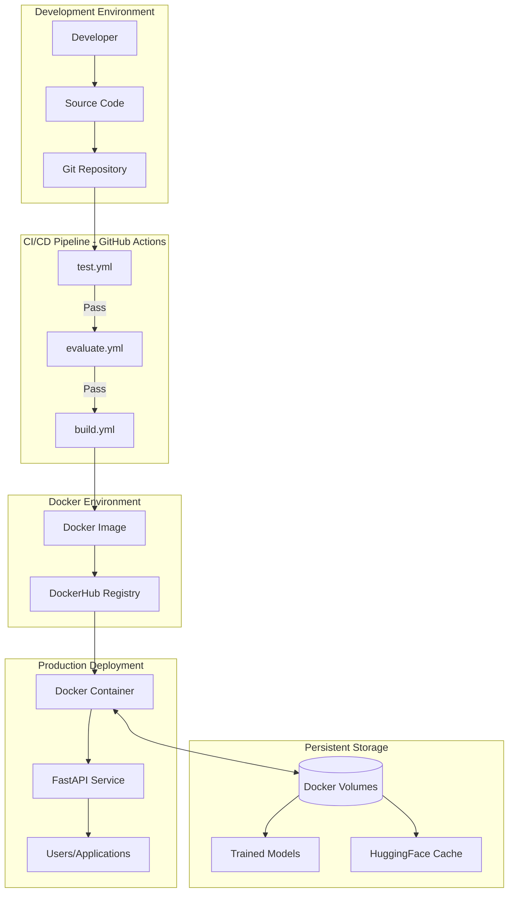
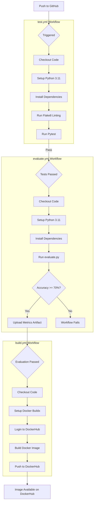
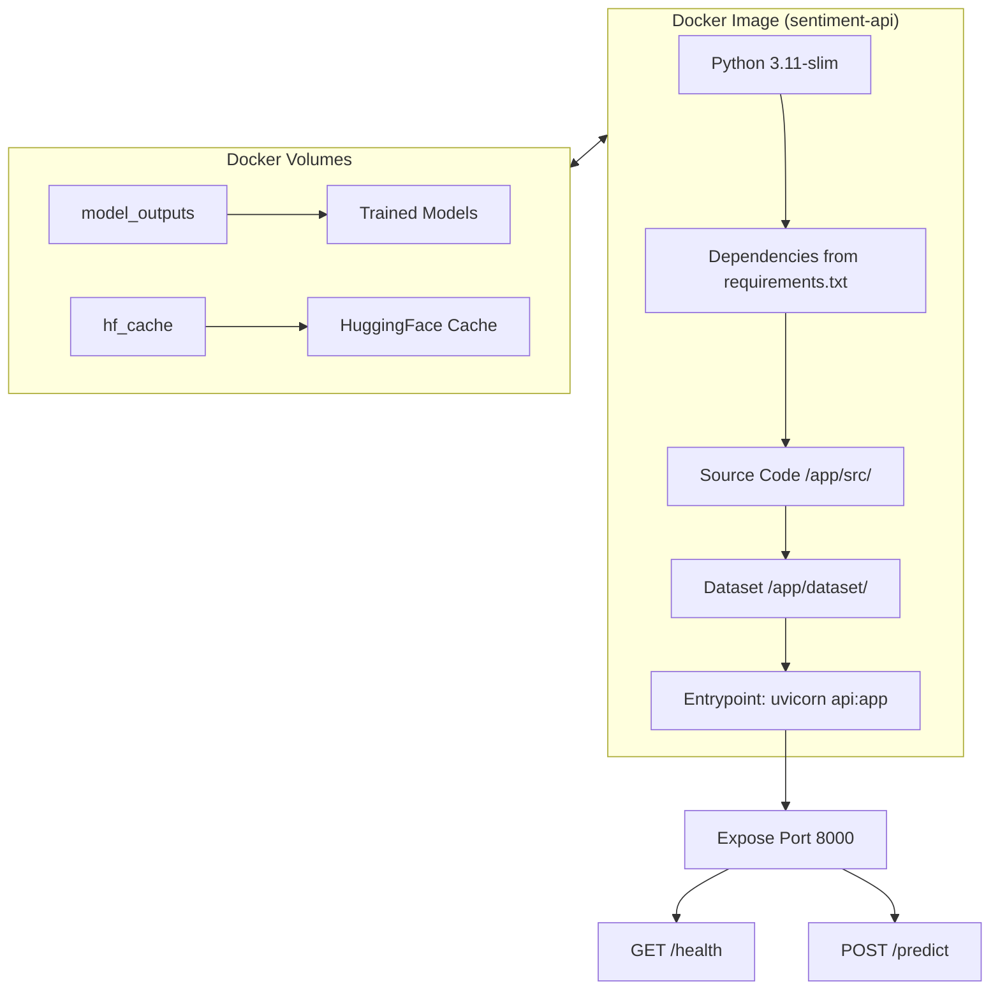
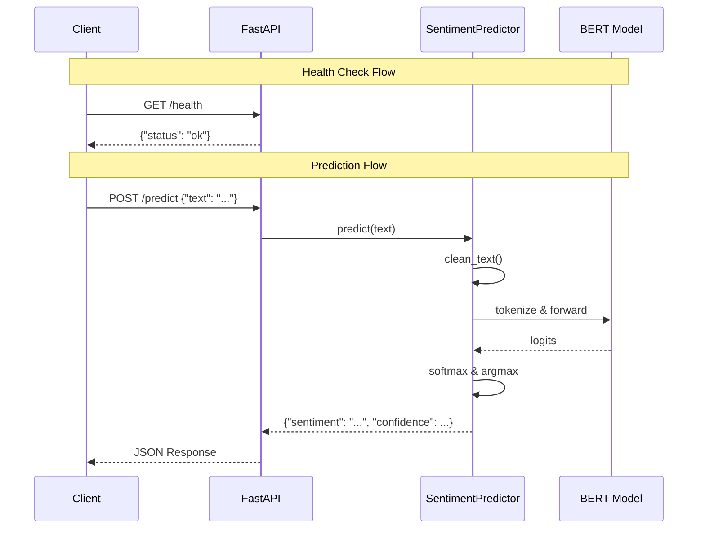
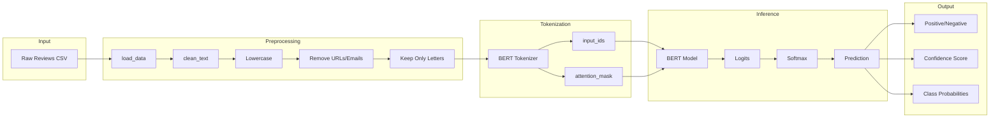

# MLOps Architecture Documentation

## Sentiment Analysis Pipeline

This document provides a comprehensive overview of our MLOps architecture for the sentiment analysis project, explaining technical choices and describing the complete workflow.

---

## 1. System Architecture Overview



---

## 2. ML Pipeline Components

```mermaid
flowchart LR
    subgraph Data["Data Layer"]
        CSV[dataset.csv] --> EXTRACT[data_extraction.py]
        EXTRACT --> PROCESS[data_processing.py]
    end
    
    subgraph Processing["Processing Layer"]
        PROCESS --> CLEAN[Text Cleaning]
        CLEAN --> TOKEN[Tokenization]
        TOKEN --> SPLIT[Train/Val Split]
    end
    
    subgraph Model["Model Layer"]
        SPLIT --> TRAIN[model.py]
        TRAIN --> BERT[Fine-tuned BERT]
        BERT --> SAVE[model_outputs/]
    end
    
    subgraph Inference["Inference Layer"]
        SAVE --> LOAD[inference.py]
        LOAD --> PREDICT[Predictions]
    end
```



---

## 3. Technical Choices

### 3.1 Machine Learning Stack

| Component | Technology | Justification |
|-----------|------------|---------------|
| **Base Model** | BERT (bert-base-uncased) | Pre-trained transformer with strong NLP performance |
| **Framework** | PyTorch + HuggingFace Transformers | Industry standard, rich ecosystem |
| **Evaluation** | DistilBERT-SST2 | Fast evaluation with pre-trained sentiment model |
| **Serialization** | Joblib | Efficient serialization for scikit-learn compatible objects |

### 3.2 API & Serving

| Component | Technology | Justification |
|-----------|------------|---------------|
| **Web Framework** | FastAPI | High performance, automatic OpenAPI docs, async support |
| **Server** | Uvicorn | ASGI server optimized for async Python |
| **Containerization** | Docker | Consistent environments, easy deployment |
| **Orchestration** | Docker Compose | Simple multi-service management |

### 3.3 CI/CD & DevOps

| Component | Technology | Justification |
|-----------|------------|---------------|
| **CI/CD** | GitHub Actions | Native GitHub integration, free for public repos |
| **Registry** | DockerHub | Industry standard container registry |
| **Linting** | Flake8 | Python style guide enforcement |
| **Testing** | Pytest | Feature-rich Python testing framework |

---

## 4. CI/CD Workflow



---

## 5. Docker Architecture

### 5.1 Container Structure



### 5.2 Environment Variables

| Variable | Purpose |
|----------|---------|
| `PYTHONDONTWRITEBYTECODE=1` | Prevents .pyc file creation |
| `PYTHONUNBUFFERED=1` | Real-time log output |
| `PYTHONPATH=/app/src` | Module import paths |
| `TRANSFORMERS_CACHE=/app/.cache/huggingface` | HuggingFace model cache location |
| `HF_HOME=/app/.cache/huggingface` | HuggingFace home directory |
| `MODEL_PATH` | Path to trained model file |

---

## 6. API Endpoints



---

## 7. Data Flow



---

## 8. Project Files Summary

| Category | Files | Purpose |
|----------|-------|---------|
| **Source** | `src/data_extraction.py` | Load CSV data |
| | `src/data_processing.py` | Clean, tokenize, split data |
| | `src/model.py` | Train BERT classifier |
| | `src/inference.py` | Load model and predict |
| | `src/api.py` | FastAPI REST endpoints |
| | `src/evaluate.py` | Model evaluation script |
| **Tests** | `tests/unit/*.py` | Unit tests for all modules |
| **Docker** | `Dockerfile` | Container image definition |
| | `docker-compose.yml` | Service orchestration |
| | `.dockerignore` | Files excluded from build |
| **CI/CD** | `.github/workflows/test.yml` | Testing workflow |
| | `.github/workflows/evaluate.yml` | Model evaluation workflow |
| | `.github/workflows/build.yml` | Docker build workflow |
| **Config** | `requirements.txt` | Python dependencies |
| | `pytest.ini` | Pytest configuration |
| | `.flake8` | Linting configuration |

---

## 9. Deployment Instructions

### Local Development
```bash
# Setup
python -m venv .venv
source .venv/Scripts/activate
pip install -r requirements.txt

# Run tests
pytest -q

# Run API locally
cd src && uvicorn api:app --reload
```

### Docker Deployment
```bash
# Build and run
docker compose up --build

# Test API
curl http://localhost:8000/health
curl -X POST http://localhost:8000/predict \
  -H "Content-Type: application/json" \
  -d '{"text": "Great product!"}'
```

### GitHub Actions Deployment
1. Add secrets to GitHub repository:
   - `DOCKERHUB_USERNAME`
   - `DOCKERHUB_TOKEN`
2. Push to main branch
3. Workflows automatically trigger
4. Image published to DockerHub

---

## 10. Quality Gates

| Stage | Gate | Threshold |
|-------|------|-----------|
| Linting | Flake8 | No critical errors (E9, F63, F7, F82) |
| Unit Tests | Pytest | All tests pass |
| Model Evaluation | Accuracy | ≥ 70% |
| Docker Build | Build Success | Image builds without errors |

> Pipeline fails if any gate is not met, preventing broken code from being deployed.
